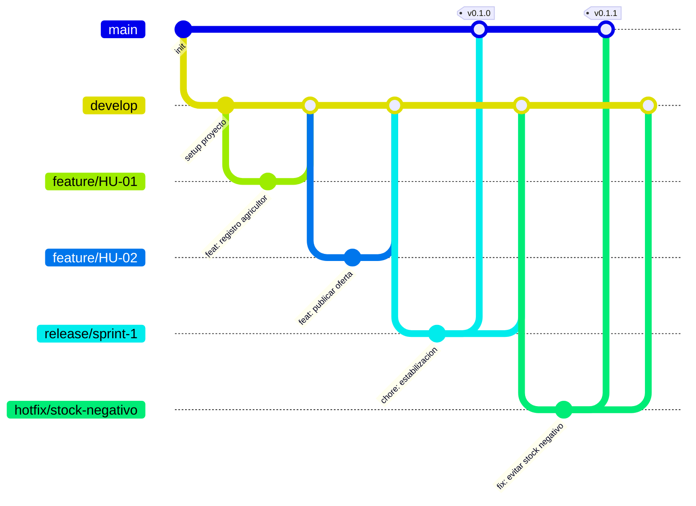

# AgroValle Connect

## Visión del producto

El Valle del Cauca tiene una alta vocación agrícola, pero la comercialización actual presenta
intermediación excesiva, falta de visibilidad de la oferta en tiempo real y ausencia de
trazabilidad y programación logística. **AgroValle Connect** es una aplicación web empresarial
que conecta directamente la oferta de las fincas del Valle del Cauca con la demanda comercial
urbana de Cali y sus alrededores, permitiendo publicar y consultar oferta agrícola, gestionar
pedidos y stock, y coordinar la logística y trazabilidad entre productores y compradores.

**Stack:** Java 17 · Spring Boot · PostgreSQL · Frontend Web

## Integrantes del equipo

> ✏️ Completa esta tabla con los nombres reales y roles del equipo antes de entregar.

| Nombre | Rol en el equipo | Usuario GitHub |
|---|---|---|
| Jhonier | | |
| David Montoya | | |
| Juan Felipe Choco | | |
| Laura Caicedo | | |

## Módulos del sistema

1. Productores y Ofertas
2. Catálogo y Búsqueda
3. Pedidos y Stock
4. Logística y Trazabilidad

## Arquitectura

Arquitectura por capas (MVC), implementada en Spring Boot:

`Controller → Service → Repository → Model/Entity`, con soporte de `DTO`, `Factory`, `Observer`
y `Config/Security` (JWT).

## Estrategia de ramas: GitFlow

Se adopta **GitFlow** para separar desarrollo, correcciones y entregas de forma ordenada:

- **`main`**: código estable, listo para producción. Solo recibe merges desde `release/*` o `hotfix/*`.
- **`develop`**: rama de integración continua del equipo.
- **`feature/HU-XX`**: una rama por historia de usuario, creada desde `develop` y fusionada de
  vuelta mediante Pull Request revisado por un par.
- **`release/*`**: estabilización de una entrega antes de pasar a `main`.
- **`bugfix/*`**: corrección de errores detectados durante el desarrollo, sobre `develop`.
- **`hotfix/*`**: corrección urgente directamente sobre `main`, luego reintegrada a `develop`.



**Regla:** ningún cambio entra a `main` sin Pull Request, pruebas automatizadas, Checkstyle sin
advertencias, cobertura mínima (JaCoCo ≥ 60%) y revisión por pares aprobada.

## Conventional Commits

| Tipo | Uso | Ejemplo |
|---|---|---|
| `feat` | Nueva funcionalidad | `feat(ofertas): agregar publicación de lotes` |
| `fix` | Corrección | `fix(stock): evitar reserva superior al inventario` |
| `test` | Pruebas | `test(pedido): validar transición a reservado` |
| `docs` | Documentación | `docs(adr): documentar decisión de PostgreSQL` |
| `refactor` | Cambio interno sin nueva funcionalidad | `refactor(pedido): separar cálculo de total` |

## Requisitos previos

- Java 17+
- Maven 3.9+
- PostgreSQL 15+
- Node.js (solo para Husky, hooks de pre-commit)

## Configuración y ejecución

```bash
git clone https://github.com/<usuario-o-equipo>/agrovalle-connect.git
cd agrovalle-connect

# Variables de entorno (ejemplo)
export DB_URL=jdbc:postgresql://localhost:5432/agrovalle
export DB_USER=agrovalle
export DB_PASSWORD=change_me
export JWT_SECRET=change_me_too

# Instalar hooks de pre-commit (Husky)
npm install
npm run prepare

# Compilar, analizar y probar
mvn -B clean verify

# Ejecutar
mvn spring-boot:run
```

## Pruebas y cobertura

- Pruebas unitarias con JUnit 5.
- Pruebas de integración Service + Repository + PostgreSQL de prueba.
- Cobertura mínima exigida: **60%**, verificada con JaCoCo (`mvn verify`).
- Cero advertencias de Checkstyle en CI.

## Documentación relacionada

- [`BACKLOG.md`](./BACKLOG.md) — Product Backlog con las 15 historias de usuario, BDD, MoSCoW y Story Points.
- [`docs/dod.md`](./docs/dod.md) — Contrato de Calidad / Definition of Done.

## CI/CD

El pipeline de GitHub Actions (`.github/workflows/ci-cd.yml`) ejecuta build, Checkstyle, pruebas
y JaCoCo en cada push/PR a `main` y `develop`, y despliega a staging al fusionar en `main`.
